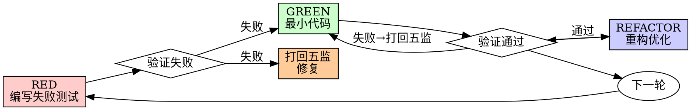

# 兵部测试驱动开发技能

## 概述

先写测试，观察失败，写最小代码使其通过。

**核心原则**: 如果你没有看到测试失败，你就不知道它是否测试了正确的东西。

**铁律**: 没有测试失败就不写生产代码。

**五监打回机制**: 兵部只负责测试验证，测试失败后打回给五监修复。

## 五监职责划分

```
┌─────────────────────────────────────────────────────────────────┐
│                         三省六部职责                              │
├─────────────────────────────────────────────────────────────────┤
│  兵部（测试部）                                                 │
│  ├── 接收尚书令任务                                             │
│  ├── 分析测试需求，编写测试用例                                  │
│  ├── 执行 RED-GREEN-REFACTOR 循环                               │
│  └── 测试失败 → 打回给五监对应部门                              │
├─────────────────────────────────────────────────────────────────┤
│  五监（实现部）                                                 │
│  ├── 将作监：核心业务逻辑                                       │
│  ├── 少府监：前端交互逻辑                                       │
│  ├── 军器监：安全相关代码                                       │
│  ├── 都水监：数据处理相关                                       │
│  └── 国子监：框架/架构相关                                      │
└─────────────────────────────────────────────────────────────────┘
```

## 何时使用

**必须使用**:
- 新功能开发
- Bug 修复
- 重构
- 行为变更

**例外（需用户确认）**:
- 一次性原型
- 生成的代码
- 配置文件

## RED-GREEN-REFACTOR 循环



### RED - 编写失败测试

编写一个最小的测试来展示预期行为。

**要求**:
- 一个行为
- 清晰的名称
- 真实代码（除非不可避免）

### 验证 RED - 观察它失败

**必须执行**:
```bash
npm test path/to/test.test.ts
```

确认:
- 测试失败（非报错）
- 失败信息符合预期
- 失败原因是功能缺失（非拼写错误）

**测试通过了？** 你在测试已有行为。修复测试。

### GREEN - 最小代码

写最简单的代码使测试通过。

**不要**:
- 添加功能
- 重构其他代码
- 超出测试需要

### 验证 GREEN - 观察它通过

**必须执行**:
```bash
npm test path/to/test.test.ts
```

确认:
- 测试通过
- 其他测试仍然通过
- 输出干净（无错误、警告）

**测试失败？** 修复代码，不是测试。

### 测试失败时的打回流程

当 GREEN 阶段验证失败时，兵部必须：

1. **填写打回敕令**
2. **发送至对应五监**
3. **等待五监修复**
4. **重新验证**

## 五监打回敕令模板

```markdown
# 兵部打回敕令

**敕令编号**: BTD-YYYYMMDD-XXX
**日期**: YYYY-MM-DD
**兵部呈**: 尚书令
**主送**: [五监对应部门]
**抄送**: 尚书令

## 一、测试任务
[描述本次测试任务]

## 二、测试环境
- 测试文件: [path/to/test]
- 被测模块: [module/path]
- 相关五监: [将作监/少府监/军器监/都水监/国子监]

## 三、RED阶段 - 测试失败
- 状态: 🔴 失败
- 测试命令: `npm test -- --testPathPattern=xxx`
- 退出码: [code]

### 失败详情
```
[粘贴失败信息和错误堆栈]
```

## 四、失败原因分析
[分析失败原因，明确责任部门]

## 五、打回要求
[明确需要修复的内容和标准]

## 六、回复期限
[设置合理的回复期限]

---
兵部主事（签字）: ___________
```

## 五监对应关系

| 被测代码位置 | 责任五监 |
|--------------|----------|
| src/core/* | 将作监 |
| src/frontend/* | 少府监 |
| src/security/* | 军器监 |
| src/data/* | 都水监 |
| src/framework/* | 国子监 |

## 兵部测试完成汇报

```markdown
# 兵部测试报告

**呈**: 尚书令
**日期**: YYYY-MM-DD

## 一、测试概况
| 项目 | 数值 |
|------|------|
| 测试用例数 | XX|
| 通过数 | XX |
| 失败数 | 0 |
| 打回次数 | X |

## 二、测试结果
| 敕令编号 | 被测模块 | 五监部门 | 测试结果 |
|----------|----------|----------|----------|
| BTD-001  | core/auth | 将作监 | ✅ 通过 |
| BTD-002  | ui/button | 少府监 | ✅ 通过 |

## 三、覆盖率
- 语句覆盖: XX%
- 分支覆盖: XX%

---
兵部主事（签字）: ___________
```

## 常见问题处理

| 情况 | 处理 |
|------|------|
| 编译错误 | 打回给五监 |
| 断言失败 | 打回给五监 |
| 环境问题 | 兵部自行解决 |
| 测试代码bug | 兵部自行修复 |

## 验证清单

完成工作前检查:
- [ ] 每个新功能都有测试
- [ ] 每个测试失败前都观察到了失败
- [ ] 每个测试失败原因正确（功能缺失，非拼写）
- [ ] 写了最小代码通过每个测试
- [ ] 所有测试通过
- [ ] 输出干净（无错误、警告）
- [ ] 测试使用真实代码
- [ ] 覆盖边界情况和错误
